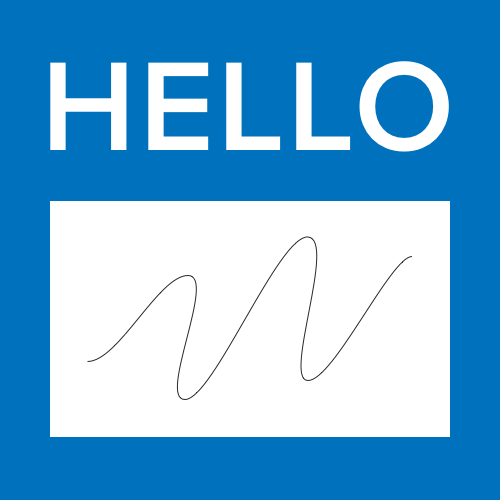

# Naming Conventions Plus

##### by Michael C. Albers

## Add to your Sketch document

[:heavy_plus_sign: :heavy_plus_sign: Add to the Sketch document you have open currently :heavy_plus_sign: :heavy_plus_sign:](sketch://add-assistant?url=https://registry.npmjs.org/naming-conventions-assistant-plus/-/naming-conventions-assistant-plus-1.2.4.tgz)

## Leverage and extend

The "naming-conventions-assistant-plus" repository is inspired by and extends
[Sketch's Naming Conventions assistant](https://github.com/sketch-hq/sketch-assistants/tree/main/assistants/naming-conventions).

## Rules

- [Artboard names](https://github.com/sketch-hq/sketch-assistants/tree/main/assistants/core/src/rules/name-pattern-artboards)
  start with numbers, e.g. `1.0.0 Splash Screen`
- [Artboards](https://github.com/sketch-hq/sketch-assistants/tree/main/assistants/core/src/rules/name-pattern-artboards)
  have informative descriptions (not default names like `Artboard`)
- [Groups](https://github.com/sketch-hq/sketch-assistants/tree/main/assistants/core/src/rules/name-pattern-groups)
  have informative descriptions (not default names like `Group`)
- [Pages](https://github.com/sketch-hq/sketch-assistants/tree/main/assistants/core/src/rules/name-pattern-pages)
  have informative descriptions (not default names like `Page 1`)
- [Layers](https://github.com/sketch-hq/sketch-assistants/tree/main/assistants/core/src/rules/name-pattern-shapes)
  have informative descriptions (not default names like `Rectangle`, `Oval`, or `Mask`)
- [Symbols](https://github.com/sketch-hq/sketch-assistants/tree/main/assistants/core/src/rules/name-pattern-symbols)
  use forward-slash grouping, e.g. `Icon / Paste`
